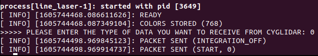
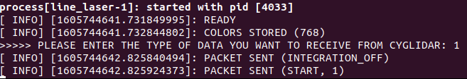
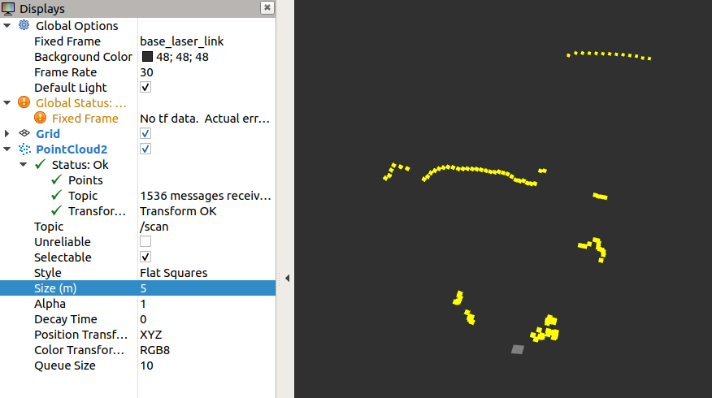
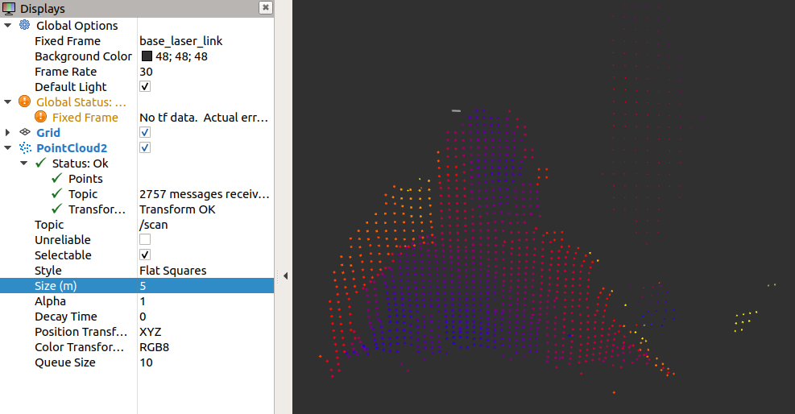

# cl-d1a0-ros
cl-d1a0-ros is a ROS package, which is designed to visualize 2D/3D distance dataset in real-time.
For more details in the 2D/3D ToF LiDAR, please visit http://www.cygbot.com

## How to build this package
### Preparation
1) Clone this project to your catkin's workspace
2) Run catkin_make
### Set-Up
```bash
source devel/setup.bash
ls -l /dev | grep ttyUSB
sudo chmod 666 /dev/ttyUSB0
roslaunch cyglidar_pcl cyglidar_pcl.launch
```

The result if the commands succeeded: 

## Parameters
The parameters for 2D and 3D are 0 and 1 respectively as done below:

2D)
<h1 align="left">
  
</h1>

3D)
<h1 align="left">
  
</h1>

After adding PointCloud2 on RVIZ, the fixed frame is required to be given.
### Fixed Frame
```bash
base_laser_link
```
If you don't have the topic on Displays, the param is also mandatory.
### Topic
```bash
/scan
```
### Point Size
Above 5.0 is appropriate in both 2D and 3D.

2D)
<h1 align="center">
  
</h1>

3D)
<h1 align="center">
  
</h1>
